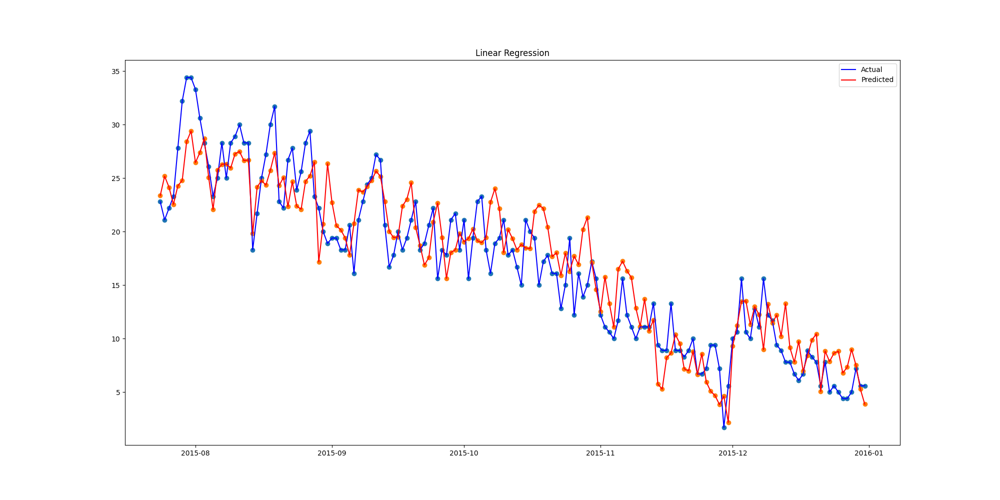
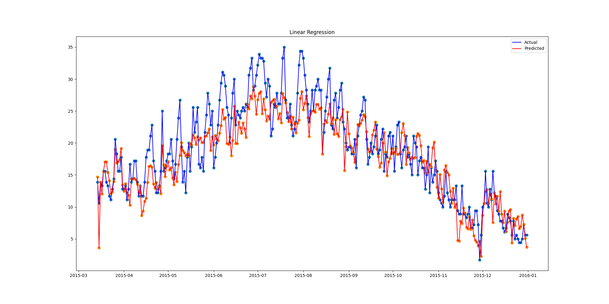

# Weather-Forecast

## Task 1 - Dataset

The table needs to be analysed in order to verify values and understand the logic.

### _dataframe.info()_
`Shows more information about each column of the table, including the total number of entries in
the table, and the number of non-null values.`

RangeIndex: 1461 entries, 0 to 1460

| NO. | Column        | Non-Null Count | Dtype   |
|-----|---------------|----------------|---------|
| 0   | date          | 1461 non-null  | object  |
| 1   | precipitation | 1461 non-null  | float64 |
| 2   | temp_max      | 1461 non-null  | float64 |
| 3   | temp_min      | 1461 non-null  | float64 |
| 4   | wind          | 1461 non-null  | float64 |
| 5   | weather       | 1461 non-null  | object  |

### _dataframe.duplicated().sum()_
`Calculates the total number of entries that are duplicated in the table. In this case, the entries
are unique. `

Number of duplicated entries in the table:  0

### _dataframe.max() and dataframe.min()_
`Calculates the maximum and minimum values on a column. The maximum and minimum values of a column
can be found by using dataframe.name_column.max() and dataframe.name_column.min(). ` 

Maximum temperature reached:  35.6
Minimum temperature reached:  -7.1

### _dataframe.value_counts().idxmax()_
`value_counts() calculates the number of appearances of different entries in a table, while idxmax()
selects the attribute with the biggest number.`

Most common weather:  rain

## Task 2 - Plots
### Maximum temperature shown using simple Histplot
The approximate average temperature reached through the years is between 10 and 15 degrees.

### Maximum temperature shown using simple FaceGrid Lineplot
The temperatures through the years tend to have the same maximum value and concave curve.

### Precipitation shown using simple FaceGrid Scatterplot
In 2015, there are more values that tend to reach the maximum number of precipitations.

### Weather conditions shown using countplot
By analysing the plot, it is remarked that it has rained the most throughout the years. The sunny
days are also tending to reach maximum value.

### Weather conditions shown using pieplot
All the values are calculated using percentages.

## Task 3 - Weather Prediciton
### Linear Regression - Default

### Linear Regression - Random

### Linear SVR

