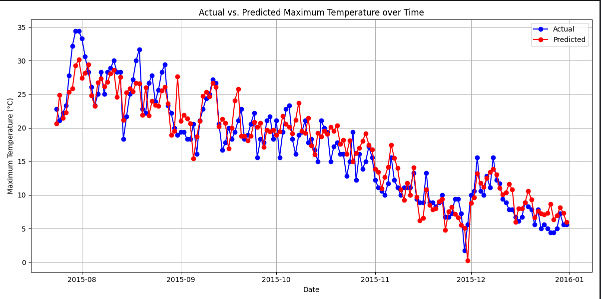

# Weather-Forecast

## Setup

Fork the repository, then clone it on your local machine. Inside the root folder run `poetry install`. That should install all the dependencies.

We will be using [pandas](https://pandas.pydata.org/docs/) a powerful Python framework that allows us to create data structures that can hold datasets. We will also be using 
[Numpy](https://numpy.org/) and [Seaborn](https://seaborn.pydata.org/). Take a bit of time to read through those!

## Tasks 

We will attempt to forecast the weather conditions in Seattle. We can find the dataset in _'seattle-weather.csv'_.

### Task 1 - Dataset 

Looking through a CSV is very boring, but at the same time we should also know what kind of data we have at our disposal. 

Ah, I know! I think Pandas has some kinds of functions to help out with that. Check out [`pandas.Dataframe.info`](https://pandas.pydata.org/docs/reference/api/pandas.DataFrame.info.html).

Now that I think of it, we should check if there are any null or duplicate rows in our dataset.

And what are our `min_temp` and `max_temp`? Or what is the most common `weather condition`?

Use the `dataset_info` function to display whatever information you find useful about the dataset!

### Task 2 - Exploratory analysis

I mean tables are not that much more interesting than CSVs. But you know what is?

✨ PLOTS ✨

Let's make lots and lots of plots and add them to the [investigation file](INVESTIGATION.md) with a proper description.

Let's see what the most common max temperatures are by creating a plot with `temp_max`(X-axis) by `count`(Y-axis) with [histplot](https://seaborn.pydata.org/generated/seaborn.histplot.html). 

That doesn't tell us much, so we could try using a [FacetGrid](https://seaborn.pydata.org/generated/seaborn.FacetGrid.html) in combination with a lineplot. We should create two new columns in our dataframe by extracting the year and the month. Don't forget to change the `date` column to `datetime` type!
It should look similar to this:

What about something similar for precipitation, but instead of a lineplot, use a scatterplot?

Lastly, we should know the distribution of weather in our dataset. Create a countplot (how many of each there are) and a pie chart (what percentages do they take out of the dataset).
You can use either matplotlib or seaborn for this.

### Task 3 - Weather prediction

Now it's time for the interesting part: Can we properly predict the weather? To do that we need to split our data in a training and a testing sub-datasets and train a model to do that prediction. 

The gist of it is pretty simple:
- Have data
- Split data into training and testing splits - usually we use 80% of the data for training and 20% of it for testing - Use the [`train_test_split`](https://scikit-learn.org/stable/modules/generated/sklearn.model_selection.train_test_split.html) method 
- Choose a model! Any model! There are soooo many models! Choose the relevant features, fit the model and make the prediction.
- Now what? Well...we test it! Some common prediction metrics are [R2 score](https://en.wikipedia.org/wiki/Coefficient_of_determination) or [Mean Squared error](https://en.wikipedia.org/wiki/Mean_squared_error)

Let's juggle with a couple of concepts and variations:
- Create a `LinearRegression` model(https://scikit-learn.org/stable/modules/generated/sklearn.linear_model.LinearRegression.html) to predict the `temp_max` with a 80-20 split and compute the R2 score and MSE. How does it perform?
- Create a `LinearRegression` model with the first 1300 entries as training data and the rest as testing data. Compute the MSE and R2 and create a scatterplot that shows the actual values with blue and the predicted values with red:

- Create a `LinearSVR` model(https://scikit-learn.org/stable/modules/generated/sklearn.svm.LinearSVR.html#sklearn.svm.LinearSVR) with the first 1300 entries as training data and the rest as testing data. Compute the MSE and R2 and create a scatterplot that shows the actual values with blue and the predicted values with red. This time try for `temp_min`.

Don't shy away from juggling with the parameters, like train-test splits or any other. Or feel free to experiment other models as well. Please document all the work done in the investigation file and also add all the plots there. You can treat this exercise as a small research assignment!

### Stretch goals

What about something...bigger...smarter...

What about...deep learning.

If there is enough time have a crack at solving this problem using a [Convolutional Neural Network](https://www.tensorflow.org/tutorials/images/cnn). How hard could it be?
